# Financial News Sentiment Classification & Analysis

## Project Implementation

### Team Members

* Zijie Ku (zijieku2) - Coordinator
  * Seeking Alpha scrapper
  * Google AutoML model training
  * Documentation
  * Presentation
* Yanbin Zhang (zhang50)
  * Forbes scrapper
  * Google AutoML model training, testing, validation
  * Documentation


### Introduction

As described in the [Course Proposal](./CS410_Project_Proposal_zijieku2_zhang50.pdf), our main goal is to create a sentiment analysis tool for financial news. In this course project, we utilized several available Financial APIs to achieve this. Even though we countered various technical difficulties, including but not limited to [Google's service disruptions](https://www.bbc.com/news/technology-50851420) in certain regions throughout the development stages, service throttling from the news source, etc., we are able reach our goal to train models to classify and to analyze the sentiment of the financial news. With our tool, user can get a general sense of the sentiment of new article(s).


### Implementation Phases

The summary of the whole implementation process can be broken down in the following phases:

- Phase I - Fetch top mentioned tickers with Stock News API from the past 30 days.
- Phase II - Retrieve relevant historical news along with labeled sentiment data from the past 60 days.
- Phase III - Use machine learning techniques to train models with Google AutoML.
- Phase IV - Test and validation on the trained models.


### Analysis Results

According to the text classification, three categories are classified, namely "positive", "neutral", and "negative". In our project, the sentiment analysis model has three categories, 0 - "positive", 1 - "neutral", and 2 - "negative" correspondingly.

While the Nasdaq composite has a positive gain at the moment of writing this documentation, but Uber's stock price is clearly affected by this 'negative' (2) news about its Ex-CEO, Travis. 

* **Nasdaq composite**: Bullish market
  * 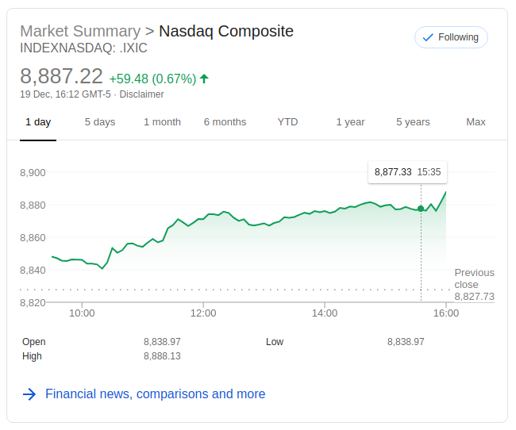
* **Uber**: Bearish market
  * 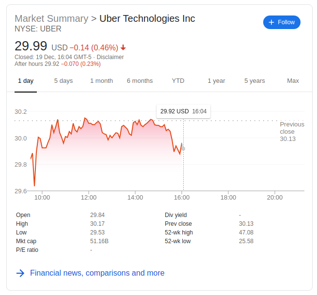


### Testing Results

#### Models

_All_ models will be available under the `Models` section as following.

* 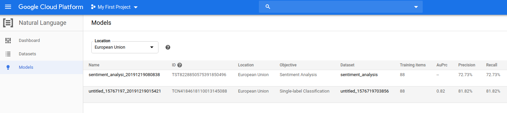


#### Scrape the latest financial news about top mentioned stocks

* Use `get_stock_news(top_stocks, today=True)` to fetch latest news. (Or use any news if the user would like to as an alternative input).

  * e.g:

    ```
    top stocks: ['GOOGL', 'FB', 'UBER', 'MSFT', 'NVDA', 'INTC', 'T', 'CRM', 'AMD', 'AAPL']
    UBER has 2 news
            >> url: https://www.forbes.com/sites/elanagross/2019/12/19/uber-settles-with-the-eeoc-to-the-tune-of-44-million/
            >> url: https://www.forbes.com/sites/bizcarson/2019/12/18/uber-travis-kalanick-sells-most-of-his-shares/
            completed scapping for UBER
    ```

* Go to `Test & Use`

  * **AutoML Text & Document Classification**:
    * 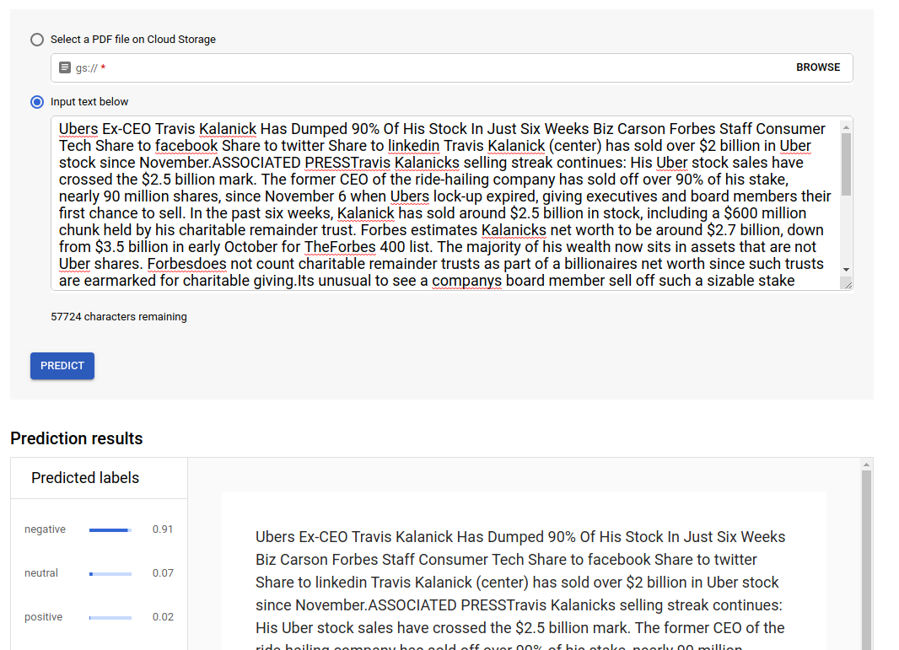
  * **AutoML Sentiment Analysis**:
    * 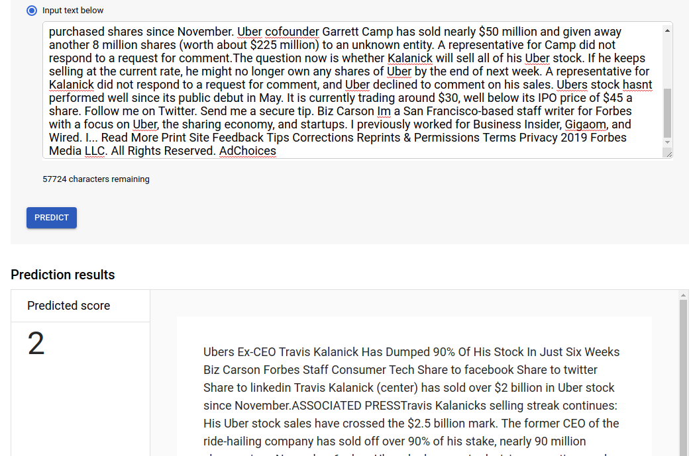

* As we can see, both the classification and sentiment analysis suggested the same prediction for the sample news as "negative" opinion.


<div style="page-break-after: always; break-after: page;"></div>

## Software Tutorial

### Setup

#### Scrapper

##### Install new packages

```python
# Ensure your pip is up to date
pip install --upgrade pip

# install Beautiful Soup
pip install bs4

# install requests
pip install requests
```


##### Required packages

```python
import time # required to sleep for n seconds if encounter web service throttling
import requests # required to make get request to API
import datetime import datetime, timedelta # required to calculate time frame
```


##### API: [Stock News API](https://stocknewsapi.com)

* [API Documentation](https://stocknewsapi.com/documentation)
* Available News Sources:
  * 24/7 Wall Street, Benzinga, Bloomberg Markets and Finance, Bloomberg Technology, Business Insider, CNBC, CNBC International TV, CNBC Tlevision, CNET, CNN, CNN Business, Digital Trends, Deadline, Engadget, ETF Trends, Fast Company, **Forbs**, Fox Business, GeekWire, Globe News Wire, Investopedia, Investors Business Daily, Market Watch, New York Post, New York Times, Reuters, **Seeking Alpha**, TechCrunch, The Motley Fool, The Street, Wall Street Journal, Yahoo Finance


##### Tasks

1. `get_top_mentioned_stocks_last30days(sector=All)`
   * Retrieves the top mentioned company tickers from the aggregated news sources.
   * Different `sectors` are available: default is set to `All`
     *  For the purpose of this project, a familiar industry is chosen, namely `Technology`
   * A default `30days` time frame was chosen arbitrarily. It could be extended much longer.
2. `get_stock_news (stocks, today=False)`
   * Retrieves historical news for the given stocks in a `list` form. 
   * `today` is set to `False` for retrieving news from the `INCLUDE_SRC` news source for the past `60days`.
     * historical news time frame usually should be longer than the top mentioned stock time frame.
     * certain news source could be added or removed.
3. `scrape_page_[news source](url)`
   * Write custom scrapper for each news source.
     * For the purpose of this project, **Seeking Alpha** and **Forbs** were chosen arbitrarily.
4. Different output files are written folders with specific file hierarchy
   * Will be explained further in details under Google AutoML Section


#### [Google AutoML](https://cloud.google.com/automl/)

* [API Documentation](https://cloud.google.com/automl/docs/)
* Registration
  * Google AutoML Home Page:
    * 
  * Browse to `Console` tag on the top-right-hand corner. Choose `Natural Language` under `ARTIFICIAL INTELLIGENCE` tag from the top-left-hand hamburger  icon.
    * 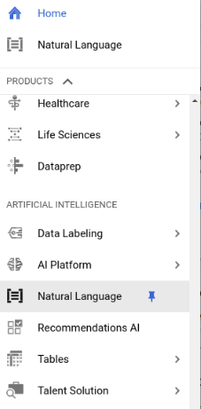


### Document Preparation & Uploads

#### Available Products

<u>Four</u> types of services are available:

* 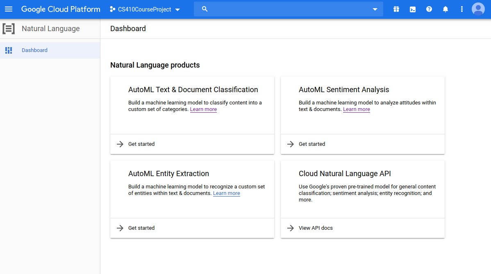

1. **AutoML Text & Document Classification**
2. **AutoML Sentiment Analysis**
3. AutoML Entity Extraction
4. Cloud Natural Language API

* For the purpose of this project, first two were chosen. 


#### AutoML Text & Document Classification

* Choose `Get started` to initialize the project
* Choose`New Dataset`
* Choose `Single-label Classification` for sentiment classification
* 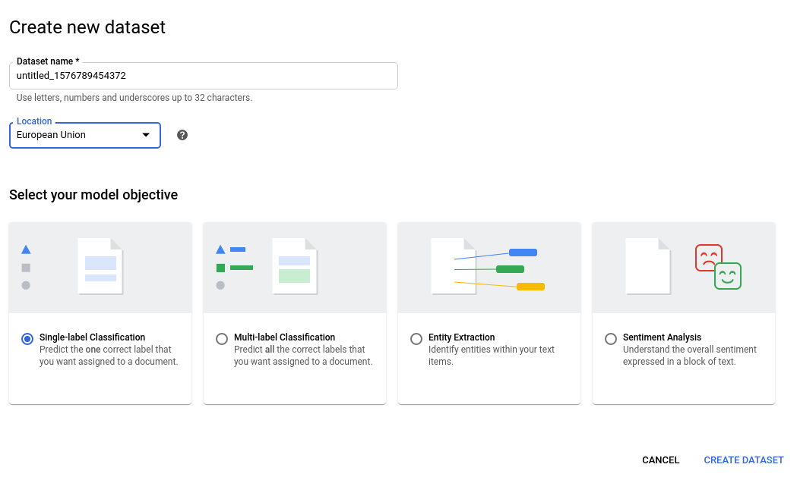
* Worth noticing that:
  * `Dataset name` cannot be modified later. 
  * `Location` is important as newly release AutoML service is extremely unstable. Hosting service on regional server may have a better performance and availability than that provided by the default `Global` scope.


#### AutoML Sentiment Analysis

* Similar to the **AutoML Text & Document Classification** step.


#### Document Uploads

* 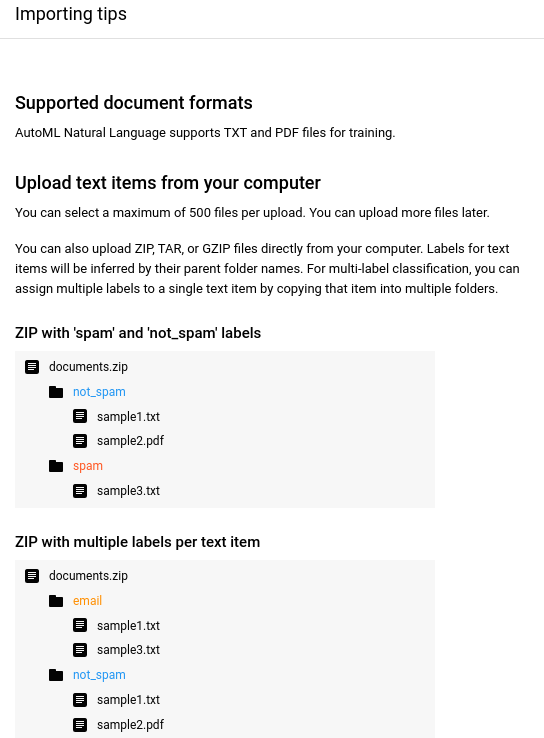

* **AutoML Text & Document Classification**

  * **ONLY USE TEXT LABELS**

    * e.g.

      ```
      + documents.zip
      |---- [text label 1]
      |     + sample1.txt
      |     + sample2.txt
      |---- [text label 2]
      |     + sample3.txt
      ```

  * Make sure each sample document has unique name for only **ONE** of the labels, since we are only doing single label classification, a one-to-one relation classification

  * It will take a moment to upload your documents and import them to the service.

    * 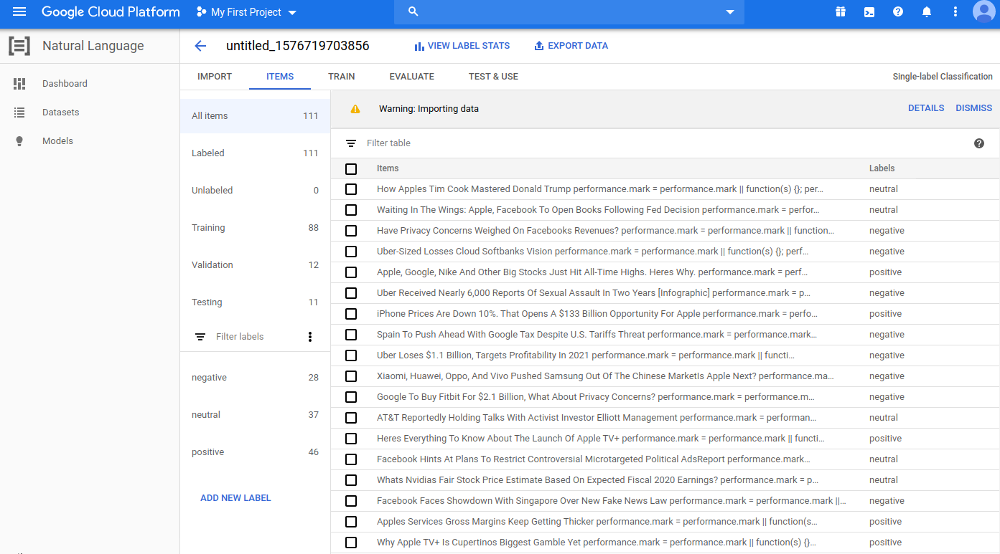

  * Click on `TRAIN` once imported files to the Google Natural Language service.

    * It takes several hours to train a model
    * Once a model is trained,  a overall evaluation of the model will be available.
      * By default, documents are divided into 80% training and 20% testing by default.
      * 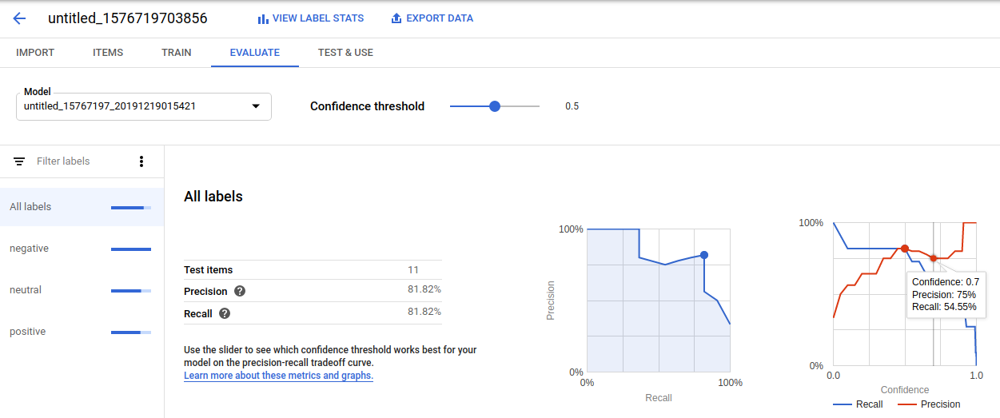
      * 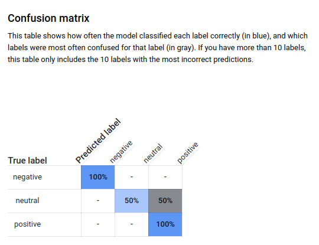

* **AutoML Sentiment Analysis**:

  * **ONLY USE INTEGER LABELS**

    * e.g.

      ```
      + documents.zip
      |---- [integer label 1]
      |     + sample1.txt
      |     + sample2.txt
      |---- [integer label 2]
      |     + sample3.txt
      ```

  * Make sure each sample document has unique name for only **ONE** of the labels, since we are only doing single label classification, a one-to-one relation classification.

  * Similar to the steps in the **AutoML text & document classification**:

    * 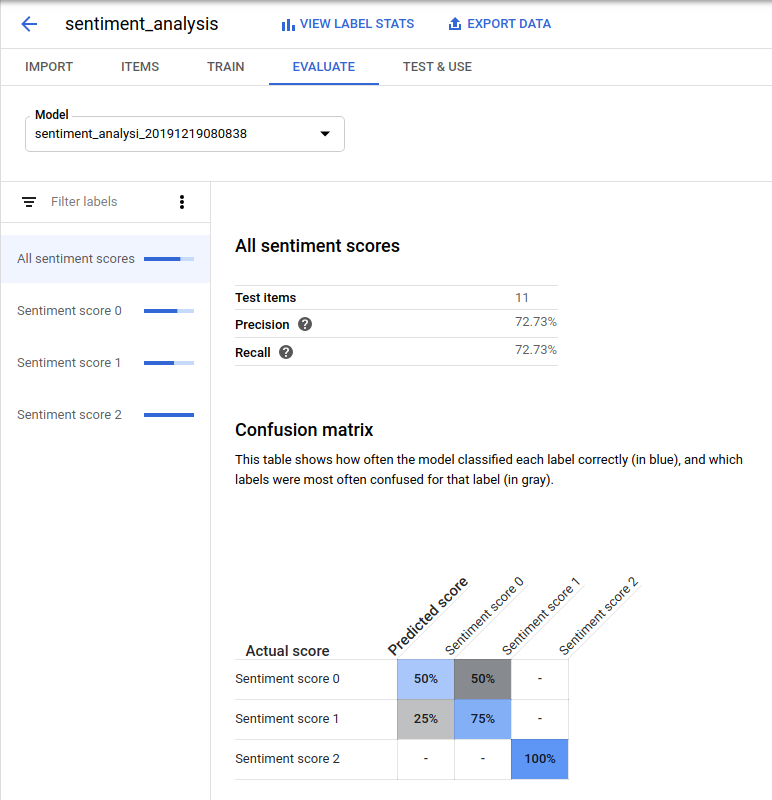

---

